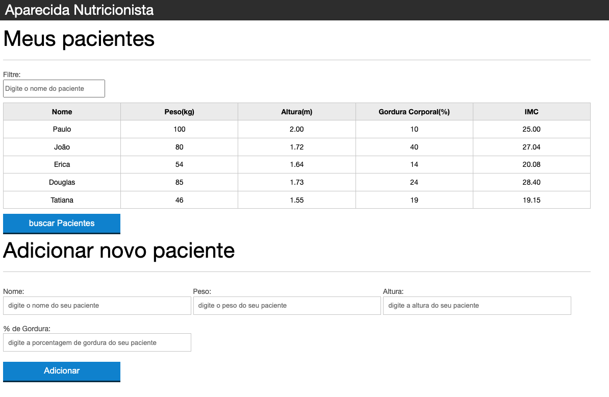

# Calculate IMC

# TECHNOLOGIES

* HTML
* CSS
* JAVASCRIPT

# I used JSON to get an API, which was Hosted on Heroku

## Thanks for viewing my project.

Don't forget to follow me on Linkedin https://www.linkedin.com/in/rafael1807/

